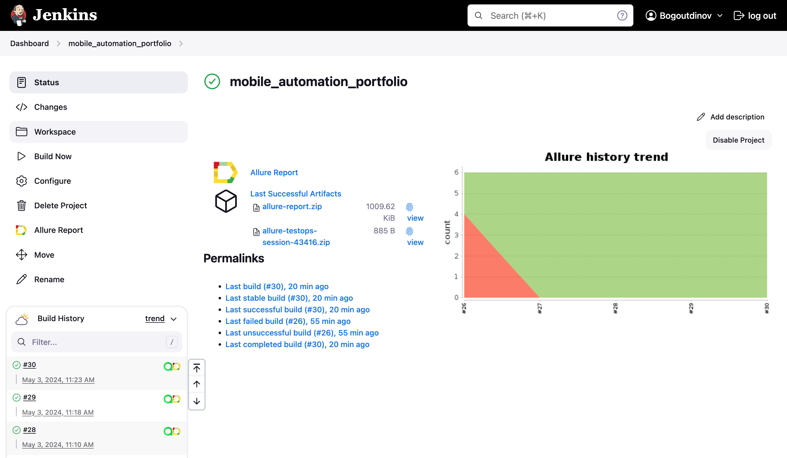

# Демо-проект по автоматизации тестирования мобильного приложения Wikipedia

<a></a>

## Содержание

* <a href="#cases">Реализованные проверки</a>

* <a href="#console">Запуск тестов из терминала</a>

* <a href="#jenkins">Запуск тестов в Jenkins</a>

* <a href="#allure">Allure Report отчеты</a>

* <a href="#allure-testops">Интеграция с Allure TestOps</a>

* <a href="#telegram">Telegram уведомления</a>

* <a href="#video">Пример видео прогона автотеста</a>

<a id="cases"></a>
##  Реализованные проверки

-  Проверка поиска статей
-  Проверка раздела с сохраненными статьями
-  Проверка раздела настроек (добавление / удаление языка)

<a id="console"></a>
##  Запуск тестов из терминала
### Локальный запуск тестов

```
gradle clean test -DdeviceHost=local
```

### Удаленный запуск тестов

```
gradle clean test -DdeviceHost=browserstack
```

<a id="jenkins"></a>
##  Запуск тестов в [Jenkins](https://jenkins.autotests.cloud/job/mobile_automation_portfolio/)

#### Главная страница Jenkins

<p align="center">
<a></a>

> Для запуска сборки необходимо нажать <strong>*Build Now*</strong>.
</p>

#### Значки Allure Report и Allure TestOps

<p align="center">


> Клик по иконкам <strong>*Allure TestOps*</strong> и <strong>*Allure Report*</strong> позволяет перейти
> на просмотр страниц с тестовой документацией и отчетов.
</p>

<a id="allure"></a>
## </a> Отчеты в [Allure Report](https://jenkins.autotests.cloud/job/mobile_automation_portfolio/30/allure/)

#### Главная страница Allure Report

<p align="center">

</p>

#### Тесты

<p align="center">

</p>

#### Графики

<p align="center">

</p>

<a id="allure-testops"></a>
## </a> Интеграция с [Allure TestOps](https://allure.autotests.cloud/project/4186/dashboards)

>Allure TestOps поддерживает подход <strong>*Test cases as a code*</strong>, что позволяет из кода поддерживать тестовую документацию в актуальном состоянии.

#### Тест-кейсы

<p align="center">

</p>

#### Дашборды

<p align="center">

</p>

<a id="telegram"></a>
## </a> Telegram уведомления

<p >

</p>

<a id="video"></a>
## </a> Пример видео прогона автотеста

<p align="center">
  
</p>